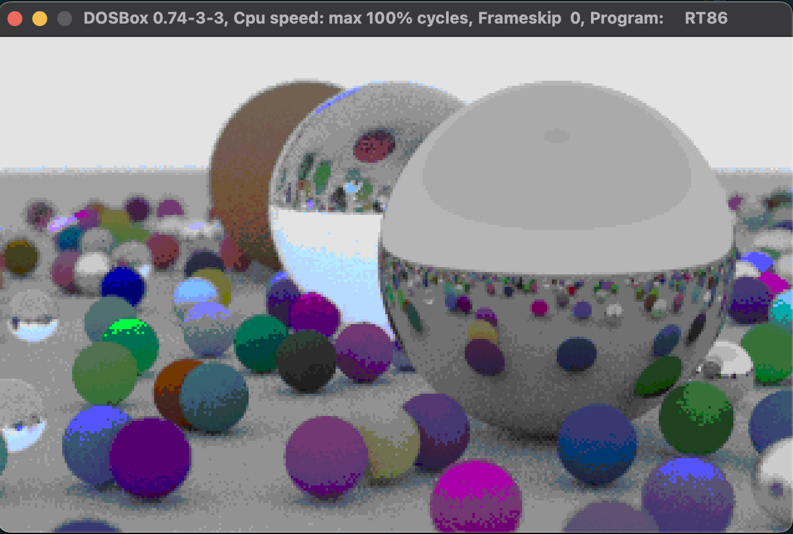

# RT86- Ray Tracing on 8086/MS-DOS
## Overview
RT86 is a ray tracing engine designed to run on MS-DOS, leveraging the simplicity and constraints of retro computing. The project explores low-level graphics programming and brings modern rendering techniques into the world of 16-bit DOS systems. With RT86, you can witness fundamental concepts like ray-object intersection, reflections, refractions and lighting – all from within a nostalgic DOS environment.



## Features
+ `Anti-Aliasing:` Smooths pixelated edges for more visually pleasing results.
+ `Sphere Rendering:` Basic ray-sphere intersection for rendering smooth surfaces.
+ `Refraction & Reflection:` Simulates glass-like transparency and realistic mirror effects.
+ `Recursive Ray Tracing:` Supports multiple reflection and refraction bounces for lifelike visuals.
+ `Camera System:` Simulates a basic camera with a configurable viewport and field of view.
+ `Multiple Objects:` Ability to add multiple spheres with distinct materials.
+ `Fixed Palette Output:` Optimized for VGA graphics (320x200 resolution, 256 colors).

## Prerequisites
+ Turbo C++ (>= 3.0)
+ Turbo Assembler (>= 4.1)
+ DOSBox or a real DOS computer

## Building
If you want to build `rt86` from source, you'll need Turbo C++ and the related [build tools](https://github.com/ms0g/breakout/tree/main/TOOLS/tcpp).
```bash
C:\TC\BIN>MAKE.EXE
C:\TC\BIN>RT86.EXE
```
## License

This project is licensed under the MIT License. See the LICENSE file for details.

## Credits

Developed by M. Sami Gürpınar